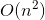

# 1. Two Sum
## Problem
Given an array of integers, return **indices** of the two numbers such that they add up to a specific target.

You may assume that each input would have **exactly** one solution, and you may not use the *same* element twice.
**Example**:  
```
Given nums = [2, 7, 11, 15], target = 9,

Because nums[0] + nums[1] = 2 + 7 = 9,
return [0, 1].
```

## Solution 0
```c++
class Solution {
public:
    vector<int> twoSum(vector<int>& nums, int target) {
        vector<int> result;
        for (int i = 0; i < nums.size() - 1; ++i) {
            for (int j = i + 1; j < nums.size(); ++j) {
                if (nums[i] + nums[j] == target) {
                    result.push_back(i);
                    result.push_back(j);
                }
            }
        }
        return result;
    }
};
```

*Time complexity:*  
  
*Space complexity:*  
  

**Idea**  
The brute force way is straightforward. Just iterate the array with two indices. This solution is accepted in LeetCode (unbelievably).

## Solution 1
```c++
class Solution {
public:
    vector<int> twoSum(vector<int>& nums, int target) {
        unordered_map<int, int> hashmap;
        vector<int> result;
        
        for (int i = 0; i < nums.size(); ++i) {
            hashmap[nums[i]] = i;
        }
        
        for (int i = 0; i < nums.size(); ++i) {
            int complement = target - nums[i];
            if (hashmap.count(complement) > 0 && hashmap[complement] != i) {
                result.push_back(i);
                result.push_back(hashmap[complement]);
                break;
            }
        }
        
        return result;
    }
};
```

*Time complexity:*  
  
*Space complexity:*  
  

**Idea**  
To reduce the time complexity from quadratic to linear time, we can use the hashmap data structure. The idea is to go through the array and store the element at i'th index as key, and the index i as value.  
With such a hashmap, we can go through the array again. For each element in the array, we check whether the complement (`target - nums[i]`) is in the hashmap. If so, we just find the solution.  
An exception is that the complement is the element itself. For example, the target is `4` and the current element is `2`. The complement is `2` as well, and it is in the hashmap. As stated in the problem description, this situation is not allowed.


## Solution 2
```c++
class Solution {
public:
    vector<int> twoSum(vector<int>& nums, int target) {
        unordered_map<int, int> hashmap;
        vector<int> result;
        
        for (int i = 0; i < nums.size(); ++i) {
            if (hashmap.count(nums[i]) > 0) {
                result.push_back(hashmap[nums[i]]);
                result.push_back(i);
            }
            else {
                // keeps the complement (target-nums[i]) as the key
                // so that we just need to go through the vector once
                hashmap[target-nums[i]] = i;
            }
        }
        
        return result;
    }
};
```

*Time complexity:*  
  
*Space complexity:*  
  

**Idea**  
The previous solution needs to go through the array twice: build the hashmap in the first loop and find the complement in the second loop. We can simplify these in one loop: instead of keeping the original element as the key, keep its complement as the key. So when the hashmap contains the element as the key, it means that we have found two elements whose sum is the target. The time complexity is still linear time, but it is faster than the previous one.

