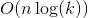

# 1300. Sum of Mutated Array Closest to Target
## Problem
[LeetCode link](https://leetcode.com/problems/sum-of-mutated-array-closest-to-target/)  
<div class="content__u3I1 question-content__JfgR"><div><p>Given an integer array&nbsp;<code>arr</code> and a target value <code>target</code>, return&nbsp;the integer&nbsp;<code>value</code>&nbsp;such that when we change all the integers&nbsp;larger than <code>value</code>&nbsp;in the given array to be equal to&nbsp;<code>value</code>,&nbsp;the sum of the array gets&nbsp;as close as possible (in absolute difference) to&nbsp;<code>target</code>.</p>

<p>In case of a tie, return the minimum such integer.</p>

<p>Notice that the answer is not neccesarilly a number from <code>arr</code>.</p>

<p>&nbsp;</p>
<p><strong>Example 1:</strong></p>

<pre><strong>Input:</strong> arr = [4,9,3], target = 10
<strong>Output:</strong> 3
<strong>Explanation:</strong> When using 3 arr converts to [3, 3, 3] which sums 9 and that's the optimal answer.
</pre>

<p><strong>Example 2:</strong></p>

<pre><strong>Input:</strong> arr = [2,3,5], target = 10
<strong>Output:</strong> 5
</pre>

<p><strong>Example 3:</strong></p>

<pre><strong>Input:</strong> arr = [60864,25176,27249,21296,20204], target = 56803
<strong>Output:</strong> 11361
</pre>

<p>&nbsp;</p>
<p><strong>Constraints:</strong></p>

<ul>
    <li><code>1 &lt;= arr.length &lt;= 10^4</code></li>
    <li><code>1 &lt;= arr[i], target &lt;= 10^5</code></li>
</ul></div></div>

### Tags
array, binary search

## Solution
```c++
class Solution {
private:
    int getMutatedSum(vector<int>& arr, int value) {
        int mutatedSum = 0;
        for (int num: arr) {
            if (num > value) {
                mutatedSum += value;
            }
            else {
                mutatedSum += num;
            }
        }
        return mutatedSum;
    }
    
public:
    int findBestValue(vector<int>& arr, int target) {
        int maxElement = 0, originalSum = 0;
        for (int num : arr) {
            maxElement = max(maxElement, num);
            originalSum += num;
        }
        
        if (target >= originalSum) {
            return maxElement;              
        }
        
        int minDiff = target, result = 0;
        int left = 1, right = maxElement;
        while (left <= right) {
            int mid = left + (right - left) / 2;
            int mutatedSum = getMutatedSum(arr, mid);
            int diff = abs(mutatedSum - target);
            if (diff < minDiff) {
                minDiff = diff;
                result = mid;
            }
            else if (diff == minDiff) {
                result = min(mid, result);
            }
            if (mutatedSum < target) {
                left = mid + 1;
            }
            else {
                right = mid - 1;
            }
        }
        return result;
    }
};
```

- Time complexity:   
- Space complexity:  
*Analysis*: `n` is the size of `arr` and `k` is the maximum element of `arr`. The binary search procedure is `O(log(k))` and in each binary search block, we go through the entire array, which needs `O(n)`. So the time complexity is `O(nlog(k))`.  

**Idea**  
Instead of brute force from `1` to `maxElement` of `arr`, we can use binary search to optimize our time complexity.  
Besides, if `target` is greater than or equal to the sum of `arr`, we can return `maxElement` directly. Because for any `value` greater than `maxElement`, the sum of mutated array will keep the same; for any `value` less than `maxElement`, the sum of mutated array will be less than the original array and get farther to `target`. Therefore, `maxElement` is the exact result.
