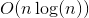

# 1305. All Elements in Two Binary Search Trees
## Problem
[LeetCode link](https://leetcode.com/problems/all-elements-in-two-binary-search-trees/)  
<div class="content__u3I1 question-content__JfgR"><div><p>Given two binary search trees <code>root1</code> and <code>root2</code>.</p>

<p>Return a list containing <em>all the integers</em> from <em>both trees</em> sorted in <strong>ascending</strong> order.</p>

<p>&nbsp;</p>
<p><strong>Example 1:</strong></p>

<pre><strong>Input:</strong> root1 = [2,1,4], root2 = [1,0,3]
<strong>Output:</strong> [0,1,1,2,3,4]
</pre>

<p><strong>Example 2:</strong></p>

<pre><strong>Input:</strong> root1 = [0,-10,10], root2 = [5,1,7,0,2]
<strong>Output:</strong> [-10,0,0,1,2,5,7,10]
</pre>

<p><strong>Example 3:</strong></p>

<pre><strong>Input:</strong> root1 = [], root2 = [5,1,7,0,2]
<strong>Output:</strong> [0,1,2,5,7]
</pre>

<p><strong>Example 4:</strong></p>

<pre><strong>Input:</strong> root1 = [0,-10,10], root2 = []
<strong>Output:</strong> [-10,0,10]
</pre>

<p><strong>Example 5:</strong></p>

<pre><strong>Input:</strong> root1 = [1,null,8], root2 = [8,1]
<strong>Output:</strong> [1,1,8,8]
</pre>

<p>&nbsp;</p>
<p><strong>Constraints:</strong></p>

<ul>
    <li>Each tree has at most <code>5000</code> nodes.</li>
    <li>Each node's value is between <code>[-10^5, 10^5]</code>.</li>
</ul></div></div>

### Tags
array, binary search tree, two pointer

## Solutions
### Solution 1
```c++
/**
 * Definition for a binary tree node.
 * struct TreeNode {
 *     int val;
 *     TreeNode *left;
 *     TreeNode *right;
 *     TreeNode(int x) : val(x), left(NULL), right(NULL) {}
 * };
 */
class Solution {
private:
    void inorder(TreeNode* node, vector<int>& v) {
        if (!node) {
            return;
        }
        inorder(node->left, v);
        v.push_back(node->val);
        inorder(node->right, v);
    }
    
public:
    vector<int> getAllElements(TreeNode* root1, TreeNode* root2) {
        vector<int> v1, v2;
        inorder(root1, v1);
        inorder(root2, v2);
        v1.insert(v1.end(), v2.begin(), v2.end());
        sort(v1.begin(), v1.end());
        return v1;
    }
};
```

- Time complexity:   
- Space complexity:  
*Analysis*: Here `n` is the number of nodes of two trees.  

**Idea**  
We can traverse two trees and get two arrays containing all the values from two binary search trees. After merging two arrays, we just need to sort the array to get the desired result.

### Solution 2
```c++
/**
 * Definition for a binary tree node.
 * struct TreeNode {
 *     int val;
 *     TreeNode *left;
 *     TreeNode *right;
 *     TreeNode(int x) : val(x), left(NULL), right(NULL) {}
 * };
 */
class Solution {
private:
    void inorder(TreeNode* node, vector<int>& v) {
        if (!node) {
            return;
        }
        inorder(node->left, v);
        v.push_back(node->val);
        inorder(node->right, v);
    }
    
    void mergeTwoSortedArrays(vector<int>& v, vector<int>& v1, vector<int>& v2, int index1, int index2) {
        while (index1 < v1.size() || index2 < v2.size()) {
            if (index1 == v1.size()) {
                v.push_back(v2[index2++]);
            }
            else if (index2 == v2.size()) {
                v.push_back(v1[index1++]);
            }
            else {
                if (v1[index1] <= v2[index2]) {
                    v.push_back(v1[index1++]);
                }
                else {
                    v.push_back(v2[index2++]);
                }
            }
        }
    }
    
public:
    vector<int> getAllElements(TreeNode* root1, TreeNode* root2) {
        vector<int> v1, v2, v;
        inorder(root1, v1);
        inorder(root2, v2);
        mergeTwoSortedArrays(v, v1, v2, 0, 0);
        return v;
    }
};
```
- Time complexity:   
- Space complexity:  
*Analysis*: `n` is the number of nodes of two trees  

**Idea**  
In fact, we can obtain sorted arrays from inorder traversing of binary search trees. Therefore, `v1` and `v2` are sorted. We just need to merge two sorted array with two pointers.