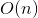
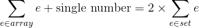
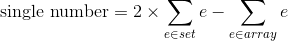
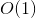

# 136. Single Number
## Problem
[LeetCode link](https://leetcode.com/problems/single-number/)  
Given a **non-empty** array of integers, every element appears *twice* except for one. Find that single one.

**Note:**

Your algorithm should have a linear runtime complexity. Could you implement it without using extra memory?

**Example 1**:  

<pre>
<b>Input:</b> [2,2,1]
<b>Output:</b> 1
</pre> 

**Example 2**:  
<pre>
<b>Input:</b> [4,1,2,1,2]
<b>Output:</b> 4
</pre>

### Tags
array, hashtable, bit manipulation

## Solutions
### Solution 1
```c++
class Solution {
public:
    int singleNumber(vector<int>& nums) {
        unordered_map<int, int> count;
        for (int num : nums) {
            count[num]++;
        }
        for (auto p : count) {
            if (p.second == 1) {
                return p.first;
            }
        }
        return 0;
    }
};
```

*Time complexity*:  
  
*Space complexity*:  
   


**Idea**  
We can use the hashmap to store the frequency of the numbers. After counting frequencies from the given array, iterate the hashmap to find whose frequency is one.

### Solution 2
```c++
class Solution {
public:
    int singleNumber(vector<int>& nums) {
        int sum = 0;
        int setSum = 0;
        unordered_set<int> hashset;
        for (int num : nums) {
            if (hashset.count(num) == 0) {
                hashset.insert(num);
                setSum += num;
            }
            sum += num;
        }
        return 2 * setSum - sum;
    }
};
```

*Time complexity*:  
  
*Space complexity*:  
  

**Idea**  
Apart from the hashmap, we can use hashset to solve this problem as well. If all numbers appear exactly twice, then the sum of the array will be twice of the sum of the hashset. There is one element which appears only once, so if add that element back to the array, the sum of array will be twice of the sum of hashset.

Therefore, we can get the single number from the equation


### Solution 3
```c++
class Solution {
public:
    int singleNumber(vector<int>& nums) {
        int result = 0;
        for (int num : nums) {
            result ^= num;
        }
        return result;
    }
};
```

*Time complexity*:  
  
*Space complexity*:  
  

**Idea**  
This solution is tricky. From the bit manipulation perspective, the result of [XOR(exclusive or)](https://en.wikipedia.org/wiki/Exclusive_or) of two same numbers is 0. So we just need an integer to store the result of XOR. After going through the array, the result will equal to the only single number.