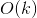

# 189. Rotate Array
## Problem
[LeetCode link](https://leetcode.com/problems/rotate-array/)  
Given an array, rotate the array to the right by *k* steps, where *k* is non-negative.

**Example 1**:  

<pre>
<b>Input:</b> [1,2,3,4,5,6,7] and <i>k</i> = 3
<b>Output:</b> [5,6,7,1,2,3,4]
<b>Explanation:</b> 
rotate 1 steps to the right: [7,1,2,3,4,5,6]
rotate 2 steps to the right: [6,7,1,2,3,4,5]
rotate 3 steps to the right: [5,6,7,1,2,3,4]
</pre> 

**Example 2**:  
<pre>
<b>Input:</b> [-1,-100,3,99] and <i>k</i> = 2
<b>Output:</b> [3,99,-1,-100]
<b>Explanation:</b> 
rotate 1 steps to the right: [99,-1,-100,3]
rotate 2 steps to the right: [3,99,-1,-100]
</pre>

**Note:**
* Try to come up as many solutions as you can, there are at least 3 different ways to solve this problem.
* Could you do it in-place with O(1) extra space?

### Tags
array

## Solutions

### Solution 1
```c++
class Solution {
public:
    void rotate(vector<int>& nums, int k) {
        k = k % nums.size();
        for (int i = 0; i < k; ++i) {
            nums.insert(nums.begin(), nums.back());
            nums.pop_back();
        }
    }
};
```

*Time complexity*:  
  
*Space complexity*:  
  
*Analysis*:  
Both time and space complexity is linear to input *k*.  
(Though the space complexity can be regarded as constant as well, since we free the original space the same time when we adding new space.)

**Idea**  
To rotate the array, we can add the last elements to the front one by one. In the iteration, we add the last element to the front, then pop that last element.

### Solution 2
```c++
class Solution {
public:
    void rotate(vector<int>& nums, int k) {
        k = k % nums.size();
        vector<int> tail(nums.begin(), nums.begin() + nums.size() - k);
        vector<int> head(nums.begin() + nums.size() - k, nums.end());
        head.insert(head.end(), tail.begin(), tail.end());
        nums = head;
    }
};
```

*Time complexity*:  
  
*Space complexity*:  
  
*Analysis*:  
There is no explicit loop in this solution. However, the copy constructors of vector need linear time. Here *n* is the size of nums. 

**Idea**  
Split the `nums` array into two parts: `tail` and `head`. `tail` is the front part of the original array, and `head` is the original back part. We just need to concatenate two arrays to the new array and that is just the result.

### Solution 3
```c++
class Solution {
private:
    void reverse(vector<int>& nums, int begin, int end) {
        while (begin < end) {
            int temp = nums[begin];
            nums[begin] = nums[end];
            nums[end] = temp;
            begin++;
            end--;
        } 
    }
    
public:
    void rotate(vector<int>& nums, int k) {
        k = k % nums.size();
        reverse(nums, 0, nums.size() - 1);
        reverse(nums, 0, k - 1);
        reverse(nums, k, nums.size() - 1);
    }
};
```

*Time complexity*:  
  
*Space complexity*:  
  
*Analysis*:  
We go through the array twice and it is still linear time. As for the space complexity, we just need constant space (for value change) in this solution.

**Idea**  
This idea is a bit tricky. With the first `reverse()` call, the back part is moved to the front. The following two `reverse()` just restore the two parts' elements to the correct order. 