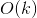

# 215. Kth Largest Element in an Array
## Problem
[LeetCode link](https://leetcode.com/problems/kth-largest-element-in-an-array/)  
<div class="content__u3I1 question-content__JfgR"><div><p>Find the <strong>k</strong>th largest element in an unsorted array. Note that it is the kth largest element in the sorted order, not the kth distinct element.</p>

<p><strong>Example 1:</strong></p>

<pre><strong>Input:</strong> <code>[3,2,1,5,6,4] </code>and k = 2
<strong>Output:</strong> 5
</pre>

<p><strong>Example 2:</strong></p>

<pre><strong>Input:</strong> <code>[3,2,3,1,2,4,5,5,6] </code>and k = 4
<strong>Output:</strong> 4</pre>

<p><strong>Note: </strong><br>
You may assume k is always valid, 1 ≤ k ≤ array's length.</p>
</div></div>

### Tags
array, sorting, heap, divide and conquer

## Solutions
### Solution 1
```c++
class Solution {
public:
    int findKthLargest(vector<int>& nums, int k) {
        sort(nums.begin(), nums.end());
        return nums[nums.size() - k];
    }
};
```

- Time complexity:   
- Space complexity:  


**Idea**  
The first solution is so simple. Just sort the array and we can fetch the desired element quickly.

### Solution 2
```c++
class Solution {
public:
    int findKthLargest(vector<int>& nums, int k) {
        priority_queue<int, vector<int>, greater<int>> pq;
        for (int num : nums) {
            pq.push(num);
            if (pq.size() > k) {
                pq.pop();
            }
        }
        return pq.top();
    }
};
```
- Time complexity:   
- Space complexity:  

*Analysis*:  
Time complexity is reduced a bit (from `O(nlogn)` to `O(nlogk)`) with the help of the min-heap. To maintain the heap with size `k`, the time complexity of `HEAPIFY` is `O(h)`, where `h` is the height of the heap and `h = log(k)`.  

**Idea**  
We can use the idea of min-heap and maintain the size of min-heap as `k`. If the size is less than `k`, just add the elements to the min-heap. Then if the size of min-heap is `k`, we need to pop one element after pushing one element into. We can assure that the top element of priority queue is the kth largest element we have seen so far. And after the loop, the final top element is exactly what we want.  
`priority_queue` is a built-in data structure defined in header `<queue>` and it is exactly what we need. Note that the default `priority_queue` applies `max-heap`, and what we need is a `min-heap` in this problem. So we can declare the `priority_queue` as `priority_queue<int, vector<int>, greater<int>> pq;`.