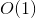

# 26. Remove Duplicates from Sorted Array
## Problem
Given a sorted array nums, remove the duplicates in-place such that each element appear only once and return the new length.

Do not allocate extra space for another array, you must do this by **modifying the input array [in-place](https://en.wikipedia.org/wiki/In-place_algorithm)** with O(1) extra memory.  
**Example 1**:  

<pre>
Given <i>nums</i> = <b>[1,1,2]</b>,
Your function should return length = <b>2</b>, with the first two elements of <i>nums</i> being <b>1</b> and <b>2</b> respectively.
It doesn't matter what you leave beyond the returned length.
</pre>

**Example 2**:  

<pre>
Given <i>nums</i> = <b>[0,0,1,1,1,2,2,3,3,4],</b>
Your function should return length = <b>5</b>, with the first five elements of <i>nums</i> being modified to <b>0, 1, 2, 3,</b> and <b>4</b> respectively.
It doesn't matter what you leave beyond the returned length.
</pre>

**Clarification**:  
Confused why the returned value is an integer but your answer is an array?

Note that the input array is passed in by **reference**, which means modification to the input array will be known to the caller as well.

Internally you can think of this:  

<pre>
// <b>nums</b> is passed in by reference. (i.e., without making a copy)
int len = removeDuplicates(nums);
<div>
// any modification to <b>nums</b> in your function would be known by the caller.
// using the length returned by your function, it prints the first <b>len</b> elements.
for (int i = 0; i < len; i++) {
    print(nums[i]);
}
</pre>

## Solution
```c++
class Solution {
public:
    int removeDuplicates(vector<int>& nums) {
        if (nums.size() < 2) {
            return nums.size();
        }
        
        int left = 0, right = 1;
        while (right < nums.size()) {
            if (nums[left] != nums[right]) {
                nums[++left] = nums[right++];
            }
            else {
                right++;
            }
        }
        return left + 1;
    }
};
```

*Time complexity:*  
  
*Space complexity:*  

*Analysis:*  
One while loop which goes through the array once.

**Idea**  
Since the array is sorted, we can use two pointers - one slower pointer (`left`) which indicates the number of unique numbers and one faster pointer (`right`) which skips the duplicates.  
If the value of `num[left]` does not equal to `num[right]`, which means that we have met a new value, we just need to change the original value of `left + 1` from `num[left + 1]` to `num[right]`. We don't have to worry about override because the value `num[left + 1]` has always been seen by the faster pointer.  
Finally we just need to return `left + 1` because there are `left + 1` elements from index `0` to `left`.
