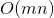

# 289. Game of Life
## Problem
[LeetCode link](https://leetcode.com/problems/game-of-life/)  
<div class="content__u3I1 question-content__JfgR"><div><p>According to the <a href="https://en.wikipedia.org/wiki/Conway%27s_Game_of_Life" target="_blank">Wikipedia's article</a>: "The <b>Game of Life</b>, also known simply as <b>Life</b>, is a cellular automaton devised by the British mathematician John Horton Conway in 1970."</p>

<p>Given a <i>board</i> with <i>m</i> by <i>n</i> cells, each cell has an initial state <i>live</i> (1) or <i>dead</i> (0). Each cell interacts with its <a href="https://en.wikipedia.org/wiki/Moore_neighborhood" target="_blank">eight neighbors</a> (horizontal, vertical, diagonal) using the following four rules (taken from the above Wikipedia article):</p>

<ol>
    <li>Any live cell with fewer than two live neighbors dies, as if caused by under-population.</li>
    <li>Any live cell with two or three live neighbors lives on to the next generation.</li>
    <li>Any live cell with more than three live neighbors dies, as if by over-population..</li>
    <li>Any dead cell with exactly three live neighbors becomes a live cell, as if by reproduction.</li>
</ol>

<p>Write a function to compute the next state (after one update) of the board given its current state.&nbsp;<span>The next state is created by applying the above rules simultaneously to every cell in the current state, where&nbsp;births and deaths occur simultaneously.</span></p>

<p><strong>Example:</strong></p>

<pre><strong>Input: 
</strong><span id="example-input-1-1">[
&nbsp; [0,1,0],
&nbsp; [0,0,1],
&nbsp; [1,1,1],
&nbsp; [0,0,0]
]</span>
<strong>Output: 
</strong><span id="example-output-1">[
&nbsp; [0,0,0],
&nbsp; [1,0,1],
&nbsp; [0,1,1],
&nbsp; [0,1,0]
]</span>
</pre>

<p><b>Follow up</b>:</p>

<ol>
    <li>Could you solve it in-place? Remember that the board needs to be updated at the same time: You cannot update some cells first and then use their updated values to update other cells.</li>
    <li>In this question, we represent the board using a 2D array. In principle, the board is infinite, which would cause problems when the active area encroaches the border of the array. How would you address these problems?</li>
</ol>
</div></div>

### Tags
array

## Solutions
### Solution 1: Additional space
```c++
class Solution {
private:
    bool isLive(vector<vector<int>>& board, int i, int j) {
        if (i < 0 || j < 0 || i >= board.size() || j >= board[0].size()) {
            return false;
        }
        return board[i][j] == 1;
    }
    
    int getLiveNeighbors(vector<vector<int>>& board, int i, int j) {
        int lives = 0;
        vector<pair<int, int>> neighbors{{-1, -1}, {-1, 0}, {-1, 1}, {0, -1}, {0, 1}, {1, -1}, {1, 0}, {1, 1}};
        for (auto neighbor : neighbors) {
            if (isLive(board, i + neighbor.first, j + neighbor.second)) {
                lives++;
            }
        }
        return lives;
    }
    
public:
    void gameOfLife(vector<vector<int>>& board) {
        int m = board.size(), n = board[0].size();
        vector<vector<int>> temp(m, vector<int>(n, 0));
        for (int i = 0; i < m; i++) {
            for (int j = 0; j < n; j++) {
                int liveNeighbors = getLiveNeighbors(board, i, j);
                if (liveNeighbors == 3 || (liveNeighbors == 2 && isLive(board, i, j))) {
                    temp[i][j] = 1;
                }
            }
        }
        board = temp;
    }
};
```

- Time complexity:   
- Space complexity:  


**Idea**  
We cannot update the state directly on the original cell, since it will cause conflict. E.g., if we update `board[0][0]` from `1` to `0`, then counting neighbors of `board[0][1]` will be incorrect.  
We can create a new 2d array to store the new state of cell to avoid conflict.

### Solution 2: In-place
```c++
class Solution {
private:
    bool isLive(vector<vector<int>>& board, int i, int j) {
        if (i < 0 || j < 0 || i >= board.size() || j >= board[0].size()) {
            return false;
        }
        return (board[i][j] == 1 || board[i][j] == -1);
    }
    
    int getLiveNeighbors(vector<vector<int>>& board, int i, int j) {
        int lives = 0;
        vector<pair<int, int>> neighbors{{-1, -1}, {-1, 0}, {-1, 1}, {0, -1}, {0, 1}, {1, -1}, {1, 0}, {1, 1}};
        for (auto neighbor : neighbors) {
            if (isLive(board, i + neighbor.first, j + neighbor.second)) {
                lives++;
            }
        }
        return lives;
    }
    
public:
    void gameOfLife(vector<vector<int>>& board) {
        int m = board.size(), n = board[0].size();
        for (int i = 0; i < m; i++) {
            for (int j = 0; j < n; j++) {
                int liveNeighbors = getLiveNeighbors(board, i, j);
                if (!isLive(board, i, j) && liveNeighbors == 3) {
                    board[i][j] = 2;            // from dead to live
                }
                if (isLive(board, i, j) && (liveNeighbors > 3 || liveNeighbors < 2)) {
                    board[i][j] = -1;           // from live to dead
                }
            }
        }
        
        for (int i = 0; i < m; i++) {
            for (int j = 0; j < n; j++) {
                board[i][j] = (board[i][j] > 0 ? 1 : 0);
            }
        }
    }
};
```
- Time complexity:   
- Space complexity:  


**Idea**  
Instead of updating cells using original notations (`1`: live, `0`: dead), we can use some new notations. Here I use two new notations: `2`: the cell goes from dead to live; `-1`: the cell goes from live to dead. Therefore, when we check the status of neighbors, we know that the cell *was* alive if status is `1` (was live and still live) or `-1` (was live but dead now). Don't forget to change the check condition in `isLive()` :D