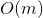

# 322. Coin Change
## Problem
[LeetCode link](https://leetcode.com/problems/coin-change/)  
<div class="content__u3I1 question-content__JfgR"><div><p>You are given coins of different denominations and a total amount of money <i>amount</i>. Write a function to compute the fewest number of coins that you need to make up that amount. If that amount of money cannot be made up by any combination of the coins, return <code>-1</code>.</p>

<p><b>Example 1:</b></p>

<pre><strong>Input: </strong>coins = <code>[1, 2, 5]</code>, amount = <code>11</code>
<strong>Output: </strong><code>3</code> 
<strong>Explanation:</strong> 11 = 5 + 5 + 1</pre>

<p><b>Example 2:</b></p>

<pre><strong>Input: </strong>coins = <code>[2]</code>, amount = <code>3</code>
<strong>Output: </strong>-1
</pre>

<p><b>Note</b>:<br>
You may assume that you have an infinite number of each kind of coin.</p>
</div></div>

### Tags
dynamic programming

## Solution
```c++
class Solution {
public:
    int coinChange(vector<int>& coins, int amount) {
        vector<int> dp(amount + 1, amount + 1);
        dp[0] = 0;
        for (int i = 1; i <= amount; i++) {
            for (int coin : coins) {
                if (coin <= i) {
                    dp[i] = min(dp[i], dp[i - coin] + 1);
                }
            }
        }
        return dp[amount] > amount ? -1 : dp[amount];        
    }
};
```

- Time complexity:   
- Space complexity:  
*Analysis*: Here `m` is the amount's value, `n` is the size of `coins`

**Idea**  
This problem can be solved with dynamic programming.  
The `dp` array is a 1-dimentional array with size `amount + 1` and initialize with value `amount + 1`. Here we choose the initial value with `amount + 1` to indicate an impossible situation, and the reason why not `INT_MAX` is that it will overflow in the loop.  
*The base case*: `amount == 0`, which means we need 0 coins to make combinations.  
*Optimal substructure*: for `amount == i`, go through each candidate `coin`, the minimal choice would be `dp[i] = min(dp[i], dp[i - coin] + 1)` (keep the original combination, or use the `coin` to achieve new optimal combination).
