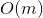

# 350. Intersection of Two Arrays II
## Problem
[LeetCode link](https://leetcode.com/problems/intersection-of-two-arrays-ii/)  
Given two arrays, write a function to compute their intersection.

**Example 1**:  

<pre>
<b>Input:</b> nums1 = [1,2,2,1], nums2 = [2,2]
<b>Output:</b> [2,2]
</pre> 

**Example 2**:  
<pre>
<b>Input:</b> nums1 = [4,9,5], nums2 = [9,4,9,8,4]
<b>Output:</b> [4,9]
</pre>

**Note:**  
- Each element in the result should appear as many times as it shows in both arrays.
- The result can be in any order.

**Follow up:**
- What if the given array is already sorted? How would you optimize your algorithm?
- What if *nums1*'s size is small compared to *nums2*'s size? Which algorithm is better?
- What if elements of *nums2* are stored on disk, and the memory is limited such that you cannot load all elements into the memory at once?

### Tags
array, two pointers, hashtable

## Solutions
### Solution 1
```c++
class Solution {
public:
    vector<int> intersect(vector<int>& nums1, vector<int>& nums2) {
        unordered_map<int, int> hashmap;
        vector<int> result;
        for (int num : nums1) {
            hashmap[num]++;
        }
        for (int num : nums2) {
            if (hashmap[num] > 0) {
                hashmap[num]--;
                result.push_back(num);
            }
        }
        return result;
    }
};
```

*Time complexity*:  
  
*Space complexity*:  
  
*Analysis*:  
Here *m* is the size of `nums1` and *n* is the size of `nums2`. The space complexity is not related to *n* because we don't store unrelevant information of `nums2` in the hashmap.  


**Idea**  
In the first loop, we count the frequencies of elements in `nums1`. In the second loop, we just check there is elements remaining in the hashmap(that is `hashmap[num] > 0`). 

### Solution 2
```c++
class Solution {
public:
    vector<int> intersect(vector<int>& nums1, vector<int>& nums2) {
        sort(nums1.begin(), nums1.end());
        sort(nums2.begin(), nums2.end());
        int p1 = 0, p2 = 0;
        vector<int> result;
        while (p1 < nums1.size() && p2 < nums2.size()) {
            if (nums1[p1] == nums2[p2]) {
                result.push_back(nums1[p1]);
                p1++;
                p2++;
            }
            else if (nums1[p1] < nums2[p2]) {
                p1++;
            }
            else {
                p2++;
            }
        }
        return result;
    }
};
```

*Time complexity*:  
  
*Space complexity*:  
  
*Analysis*:  
If the given arrays are sorted (as stated in the problem's follow up), then time complexity will reduce to linear time O(m+n).  

**Idea**  
Sort two arrays if they are unsorted. Then we can use two pointer method to find the intersection part. If the elements on two pointers are the same, then it is a common element.  
If element in `nums1` is lesser, we just need to move `p1` forward, and vice versa.  
If any pointer comes to the end of the array, we are done. There won't be any intersection elements any more.
