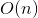

# 653. Two Sum IV - Input is a BST
## Problem
Given a Binary Search Tree and a target number, return true if there exist two elements in the BST such that their sum is equal to the given target.  

**Example 1:**  
```
<pre>
<b>Input:</b> 
    5
   / \
  3   6
 / \   \
2   4   7

Target = 9

<b>Output:</b> True
</pre>
```

**Example 2:**  
```
<pre>
<b>Input:</b> 
    5
   / \
  3   6
 / \   \
2   4   7

Target = 28

<b>Output:</b> False
</pre>
```

## Solution 1
```c++
/**
 * Definition for a binary tree node.
 * struct TreeNode {
 *     int val;
 *     TreeNode *left;
 *     TreeNode *right;
 *     TreeNode(int x) : val(x), left(NULL), right(NULL) {}
 * };
 */
class Solution {
private:
    unordered_set<int> s;
    
public:
    bool findTarget(TreeNode* root, int k) {
        if (!root)
            return false;
        if (s.count(root->val) > 0) 
            return true;
        s.insert(k - root->val);
        return findTarget(root->left, k) || findTarget(root->right, k);
    }
};
```

*Time complexity:*  
  
*Space complexity:*  
  

**Idea**  
We can use the hashmap solution mentioned in [Two Sum](https://github.com/HaelChan/LeetCode/blob/master/Explanations/1.%20Two%20Sum.md). In this problem we don't need to store the index, so hashset is sufficient. Just go through the nodes and find the result.

## Solution 2
```c++
/**
 * Definition for a binary tree node.
 * struct TreeNode {
 *     int val;
 *     TreeNode *left;
 *     TreeNode *right;
 *     TreeNode(int x) : val(x), left(NULL), right(NULL) {}
 * };
 */
class Solution {
private:
    vector<int> nodes;
    
    void inorder(TreeNode* node) {
        if (!node)
            return;
        inorder(node->left);
        nodes.push_back(node->val);
        inorder(node->right);
    }
    
public:
    bool findTarget(TreeNode* root, int k) {
        inorder(root);
        int l = 0, r = nodes.size() - 1;
        while (l < r) {
            int diff = k - nodes[r];
            if (nodes[l] == diff) {
                return true;
            }
            else if (nodes[l] < diff) {
                l++;
            }
            else {
                r--;
            }
        }
        return false;
    }
};
```

*Time complexity:*  
  
*Space complexity:*  
  

**Idea**  
By in-order traversing the binary tree, we can get the sorted array. Thus, we can apply the solution mentioned in [167. Two Sum II - Input array is sorted](https://github.com/HaelChan/LeetCode/blob/master/Explanations/167.%20Two%20Sum%20II%20-%20Input%20array%20is%20sorted.md). Though the time complexity of this solution is the same as previous one, it gets faster result.