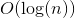

# 189. Rotate Array
## Problem
[LeetCode link](https://leetcode.com/problems/reverse-integer/)  
<div class="content__u3I1 question-content__JfgR"><div><p>Given a 32-bit signed integer, reverse digits of an integer.</p>

<p><strong>Example 1:</strong></p>

<pre><strong>Input:</strong> 123
<strong>Output:</strong> 321
</pre>

<p><strong>Example 2:</strong></p>

<pre><strong>Input:</strong> -123
<strong>Output:</strong> -321
</pre>

<p><strong>Example 3:</strong></p>

<pre><strong>Input:</strong> 120
<strong>Output:</strong> 21
</pre>

<p><strong>Note:</strong><br>
Assume we are dealing with an environment which could only store integers within the 32-bit signed integer range: [−2<sup>31</sup>,&nbsp; 2<sup>31&nbsp;</sup>− 1]. For the purpose of this problem, assume that your function returns 0 when the reversed integer overflows.</p>
</div></div>

### Tags
string, two pointer

## Solutions
### Solution 1
```c++
class Solution {
public:
    int reverse(int x) {
        if (x == INT_MIN || x == 0) return 0;
        string s = to_string(x);
        
        int left = 0, right = s.length() - 1;
        if (s[0] == '-') {
            left = 1;
        }
        
        while (left < right) {
            char temp = s[left];
            s[left] = s[right];
            s[right] = temp;
            left++;
            right--;
        }
        try {
            return stoi(s);
        }
        catch(...) {
            return 0;
        }
    }
};
```

- Time complexity: 
- Space complexity:  


**Idea**  
We can convert the integer to string, then do the [string reversion](https://github.com/HaelChan/LeetCode/blob/master/Explanations/344.%20Reverse%20String.md). A situation to note is that when the result overflow the integer range, `stoi()` will throw an exception. We just need to return `0`.
