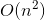

# 726. Number of Atoms
## Problem
[LeetCode link](https://leetcode.com/problems/number-of-atoms/)  
<div class="content__u3I1 question-content__JfgR"><div><p>Given a chemical <code>formula</code> (given as a string), return the count of each atom.
</p><p>
An atomic element always starts with an uppercase character, then zero or more lowercase letters, representing the name.
</p><p>
1 or more digits representing the count of that element may follow if the count is greater than 1.  If the count is 1, no digits will follow.  For example, H2O and H2O2 are possible, but H1O2 is impossible.
</p><p>
Two formulas concatenated together produce another formula.  For example, H2O2He3Mg4 is also a formula.  
</p><p>
A formula placed in parentheses, and a count (optionally added) is also a formula.  For example, (H2O2) and (H2O2)3 are formulas.
</p><p>
Given a formula, output the count of all elements as a string in the following form: the first name (in sorted order), followed by its count (if that count is more than 1), followed by the second name (in sorted order), followed by its count (if that count is more than 1), and so on.</p>

<p><b>Example 1:</b><br>
</p><pre><b>Input:</b> 
formula = "H2O"
<b>Output:</b> "H2O"
<b>Explanation:</b> 
The count of elements are {'H': 2, 'O': 1}.
</pre>
<p></p>

<p><b>Example 2:</b><br>
</p><pre><b>Input:</b> 
formula = "Mg(OH)2"
<b>Output:</b> "H2MgO2"
<b>Explanation:</b> 
The count of elements are {'H': 2, 'Mg': 1, 'O': 2}.
</pre>
<p></p>

<p><b>Example 3:</b><br>
</p><pre><b>Input:</b> 
formula = "K4(ON(SO3)2)2"
<b>Output:</b> "K4N2O14S4"
<b>Explanation:</b> 
The count of elements are {'K': 4, 'N': 2, 'O': 14, 'S': 4}.
</pre>
<p></p>

<p><b>Note:</b>
</p><li>All atom names consist of lowercase letters, except for the first character which is uppercase.</li>
<li>The length of <code>formula</code> will be in the range <code>[1, 1000]</code>.</li>
<li><code>formula</code> will only consist of letters, digits, and round parentheses, and is a valid formula as defined in the problem.</li>
<p></p></div></div>

### Tags
string, recursion

## Solution
### Solution 1
```c++
class Solution {
private:
    map<string, int> parseFormula(string formula, int& index) {
        int len = formula.length();
        map<string, int> count;
        while (index < len && formula[index] != ')') {
            if (formula[index] == '(') {
                for (auto p : parseFormula(formula, ++index)) {
                    count[p.first] += p.second;
                }
            }
            else {
                // get the name of the element
                int start = index;
                // get the lowercase part of the name
                index++;
                while (index < len && islower(formula[index])) {
                    index++;
                }
                string element = formula.substr(start, index - start);

                // get the count
                start = index;
                while (index < len && isdigit(formula[index])) {
                    index++;
                }
                
                int num = (start == index) ? 1 : stoi(formula.substr(start, index - start));
                count[element] += num;
            }
        }
        // get the count after parentheses
        int start = ++index;
        while (index < len && isdigit(formula[index])) {
            index++;
        }
        if (index != start) {
            int num = stoi(formula.substr(start, index - start));
            for (auto p : count) {
                count[p.first] *= num;
            } 
        }
        return count;
    }
    
public:
    string countOfAtoms(string formula) {
        int index = 0;
        string result = "";
        map<string, int> counts = parseFormula(formula, index);
        for (auto p : counts) {
            result += p.first;
            if (p.second > 1) {
                result += to_string(p.second);
            }
        }
        return result;
    }
};
```

- Time complexity:   
- Space complexity:  
*Analysis*: the time complexity seems to be linear since the `index` goes from begining to the end of the formula. However, as a result of multiplication after parentheses, we have to go through each *element*'s count and it leads to square time complexity.  
As for the space complexity, the recursion call stack and the hashmap both need linear space.

**Idea**  
We can solve the problem recursively. The base case is that there is no parentheses in the formula. In this case, we can parse the formula sequentially.  
The recursive relationship is that if there is a parentheses, the string inside the parentheses is another formula. We can parse it as the base case, but we also have to take the optional count after parentheses into consideration.  
We can obtain the name and the count of the element step by step, as commented in the code.

