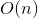
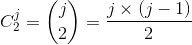

# 974. Subarray Sums Divisible by K
## Problem
[LeetCode link](https://leetcode.com/problems/subarray-sums-divisible-by-k/)  
<div class="content__u3I1 question-content__JfgR"><div><p>Given an array <code>A</code> of integers, return the number of (contiguous, non-empty) subarrays that have a sum divisible by <code>K</code>.</p>

<p>&nbsp;</p>

<div>
<p><strong>Example 1:</strong></p>

<pre><strong>Input: </strong>A = <span id="example-input-1-1">[4,5,0,-2,-3,1]</span>, K = <span id="example-input-1-2">5</span>
<strong>Output: </strong><span id="example-output-1">7</span>
<strong>Explanation: </strong>There are 7 subarrays with a sum divisible by K = 5:
[4, 5, 0, -2, -3, 1], [5], [5, 0], [5, 0, -2, -3], [0], [0, -2, -3], [-2, -3]
</pre>

<p>&nbsp;</p>

<p><strong>Note:</strong></p>

<ol>
    <li><code>1 &lt;= A.length &lt;= 30000</code></li>
    <li><code>-10000 &lt;= A[i] &lt;= 10000</code></li>
    <li><code>2 &lt;= K &lt;= 10000</code></li>
</ol>
</div></div></div>

### Tags
prefix sum, dynamic programming, math

## Solutions
### Solution 0: Dynamic Programming Without Optimization (TLE)
```c++
class Solution {
public:
    int subarraysDivByK(vector<int>& A, int K) {
        int n = A.size();
        vector<int> dp(n + 1, 0);
        
        int sum = 0, result = 0;
        for (int i = 0; i < n; i++) {
            sum += A[i];
            dp[i + 1] = sum % K;
            for (int j = 0; j <= i; j++) {
                if (dp[j] == dp[i + 1] || abs(dp[j] - dp[i + 1]) == K) {
                    result++;
                }
            }
        }
        return result;
    }
};
```

- Time complexity:   
- Space complexity:  


**Idea**  
Let's first check the example:
<pre>
A = [4,5,0,-2,-3,1], K = 5
p = [4,9,9,7,4,5]       <em>calculate the prefix sum</em>
r = [4,4,4,2,4,0]       <em>calculate the remainder</em>

r[1] == r[4] == 4
p[4] - p[1] = -5 divisible by K
A[2..4] is a subarray that we want
</pre>

Given the input array `A`, we could compute the remainder array (name it `r`) easily. We can figure out that if `r[i]==r[j]`, then `p[j]-p[i]` is divisible by `K`, which means that the subarray `A[i + 1 .. j]` is a subarray we want. Simple proof as follows:  
  
Therefore, we can use a `dp` array to store the remainders and a `sum` variable to store the prefix sum. When iterating through the input array, we just calculate the remainder `sum % K` and count the number of times that remainder appeared before.  
There are two special cases that we have to consider:
1. **The remainder with negative numbers.** In this problem, the numbers (and the prefix num) can be negative, so the remainder can be negative too. The negative remainder `x` is equivalent to the positive remainder `x+K`. E.g., consider `A = [-7,10,1], K = 5, r = [-2, 3, 4]`. Here `r[0]` is equivalent to `r[1]` so `A[1]` is a subarray.
2. **The remainder with 0.** If `r[i]==0`, it means that the subarray `A[0..i]` meets the condition. In our `dp` array, we need an additional space `dp[0]=0`, to handle the problem. Otherwise the result might the first situation when `r[i]==0`. 
In the above example, `r=[4,4,4,2,4,0]`, when we meet `r[5]=0`, since there is no `0` before `r[5]`, it won't be counted. But we know `A[0..5]` should be counted. To fix it we just set the size of `dp` to `n+1` and set the first element to `0`. 

### Solution 1: Dynamic Programming with Math Optimization (Combination)
```c++
class Solution {
public:
    int subarraysDivByK(vector<int>& A, int K) {
        vector<int> mods(K, 0);
        mods[0] = 1;
        int sum = 0, result = 0;
        for (int num : A) {
            sum += num;
            int mod = sum % K;
            if (mod < 0) {
                mod += K;
            }
            mods[mod]++;
        }
        
        for (int mod : mods) {
            result += mod * (mod - 1) / 2;
        }
        return result;
    }
};
```
- Time complexity:   
- Space complexity:  
  

**Idea**  
This idea is similar to the previous one. In this solution, we just count the appearances of each remainder(in non-negative number from `0` to `K-1`, as noted in the previous idea). After going through the array, we just need to do some combination calculation for each remainder. For each remainder `mods[i] = j`, it means that there are `j` indices where the remainder is same (=`i`) and we can pick `2` indices from those `j` indices to form a subarray. The formula is . Besides, as noted in the second point in the previous idea, index `0` is also a valid index to begin the subarray so we set `mods[0]=1`.